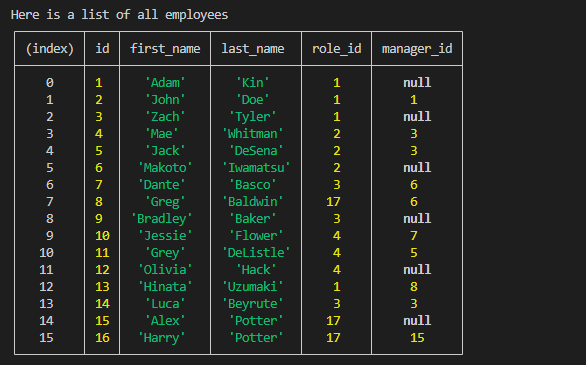
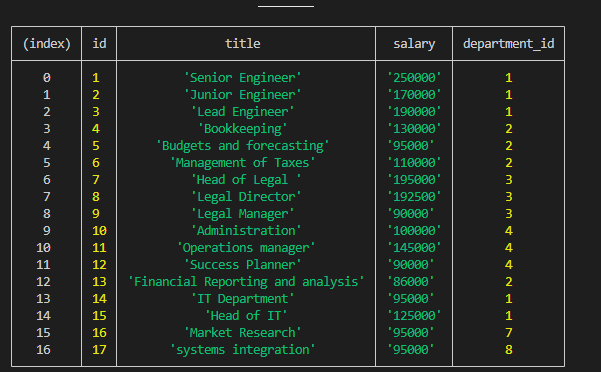
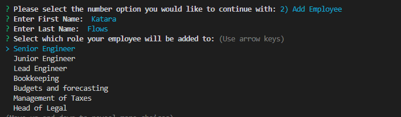

  # 12 SQL: Employee Tracker

  ## License:
   Apache 2.0   

  ## Description 
   * Motivation:
    Developers frequently have to create interfaces that allow non-developers to easily view and interact with information stored in databases. These interfaces are called **content management systems (CMS)**.
   * Build information:
    to build a command-line application from scratch to manage a company's employee database, using Node.js, Inquirer, and MySQL.
   * Problem and solutions:
    To be able to view and manage the departments, roles, and employees in a company
   * Knowledge:
    THAT I can organize and plan my business

  ## Table of Contents:
   * [Description](#description)
   * [License](#license)
   * [Installation](#installation)
   * [Usage](#usage)
   * [Credits](#Credits)
   * [Tests](#tests)
   * [Questions](#questions)

  ## Installation:
   You must install the following for this app to function:
   nmp install

  ## Usage:
  	
  	
  	
  	

  ## Credits:
   YaaseenK

  ## Tests:
   Run the following commands in your terminal to test this app:
   node index.js

  ## Contact Info:
   #Github: https://github.com/YaaseenK
   #Email: yaaseenkhan02@gmail.com
